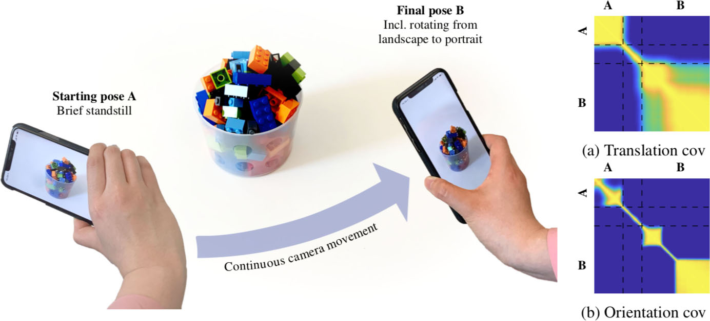

## Gaussian Process Priors for View-Aware Inference

Project page for:

* Yuxin Hou, Ari Heljakka, and Arno Solin (2019). **Gaussian Process Priors for View-Aware Inference**. [[arXiv preprint]](https://arxiv.org/abs/#)

### Abstract

We derive a principled framework for encoding prior knowledge of information coupling between views or camera poses (translation and orientation) of a single scene. While deep neural networks have become the prominent solution to many tasks in computer vision, some important problems not so well suited for deep models have received less attention. These include uncertainty quantification, auxiliary data fusion, and real-time processing, which are instrumental for delivering practical methods with robust inference. While these are central goals in probabilistic machine learning, there is a tangible gap between the theory and practice of applying probabilistic methods to many modern vision problems. For this, we derive a novel parametric kernel (covariance function) in the pose space, SE(3), that encodes information about input pose relationships into larger models. We show how this soft-prior knowledge can be applied to improve performance on several real vision tasks, such as feature tracking, human face encoding, and view synthesis.

*Illustrative sketch of the logic of the proposed method: We propose a Gaussian process prior for encoding known six degrees-of-freedom camera movement (relative pose information) into probabilistic models. In this example, built-in visual- inertial tracking of the iPhone movement is used for pose estimation. The phone starts from standstill at the left and moves to the right (translation can be seen in the covariance in (a)). The phone then rotates from portrait to landscape which can be read from the orientation (view) covariance in (b).*

### Example: View synthesis with the view-aware GP prior

The paper features several examples of the applicability of the proposed model. The last example, however, is best demonstrated with videos. Thus we have included a set of videos below for complementing the result figures in the paper.

Row #1: Frames separated by equal time intervals from a camera run, aligned on the face. Row #2: Each frame independently projected to GAN latent space and reconstructed. Row #3: Frames produced by reconstructing the first and the last frame and linearly interpolating the intermediate frames in GAN latent space. Row #4: Frames produced by reconstructing the first and the last frame, but interpolating the intermediate frames in GAN latent space by our view-aware GP prior. It can be seen that although linear interpolation achieves good quality, the azimuth rotation angle of the face is lost, as expected. With the view-aware prior, the rotation angle is better preserved. Row #5: The per-pixel uncertainty visualized in the form of standard deviation of the prediction at the corresponding time step. Heavier shading indicates higher uncertainty around the mean trajectory.

<video width="100%" controls>
  <source src="assets/video/independent-low.mp4" type="video/mp4">
  Your browser does not support the video tag. Download the video <a href="assets/video/independent-low.mp4">here</a>.
</video>

<video width="100%" controls>
  <source src="assets/video/gp-interpolation-low.mp4" type="video/mp4">
  Your browser does not support the video tag. Download the video <a href="assets/video/gp-interpolation-low.mp4">here</a>.
</video>

<video width="100%" controls>
  <source src="assets/video/gp-uncertainty-low.mp4" type="video/mp4">
  Your browser does not support the video tag. Download the video <a href="assets/video/gp-uncertainty-low.mp4">here</a>.
</video>

